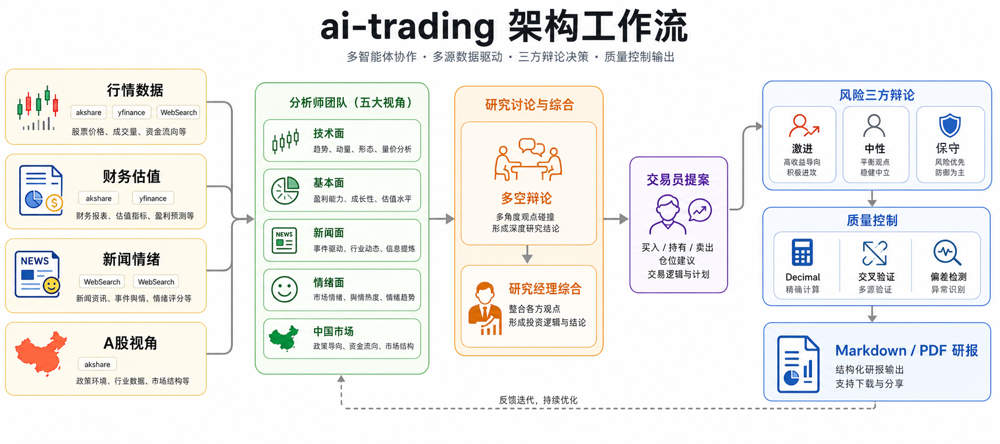

# ai-trading

> "The stock market is a device for transferring money from the impatient to the patient." — Warren Buffett

多智能体选股分析框架。用 AI 重新定义投资研究的深度与效率。

**一个人 + Claude Code / Codex = 一个投研团队**

## 多智能体架构：复刻真实投研团队的协作机制

ai-trading 模拟真实投资机构的团队协作，通过**专业分工 + 对抗性辩论**产出投资决策：

### 🔍 分析师团队（Analyst Team）

5 个专业分析师并行工作，各自从独立维度评估标的：

| 角色 | 职责 | 输出 |
|------|------|------|
| **📈 技术面分析** | 利用技术指标（MACD、RSI、均线）识别交易模式和趋势信号 | 技术形态、支撑阻力位、买卖信号 |
| **💰 基本面分析** | 评估公司财务健康度、盈利能力、估值水平，识别财报红旗 | 财务评分、合理估值区间、风险预警 |
| **📰 新闻面分析** | 监控全球新闻、宏观经济指标，解读事件对股价的潜在影响 | 事件影响评估、行业政策解读 |
| **🌡️ 情绪面分析** | 汇总社交媒体（雪球/股吧/Reddit）情绪，识别市场过热或恐慌信号 | 投资者情绪指数、舆情预警 |
| **🇨🇳 A股专属分析** | 从中国市场独有视角分析（政策、产业链、北向资金）*仅A股启用* | 政策影响、国产替代机会 |

### ⚔️ 研究团队（Research Team）

基于分析师报告，多空双方进行结构化辩论：

- **🐂 多头研究员**：陈述看涨逻辑，论证潜在收益
- **🐻 空头研究员**：挑战乐观假设，揭示下行风险
- **🧑‍⚖️ 研究经理**：综合双方观点，裁决并输出投资建议 + 目标价区间

### 💼 交易决策层

- **💼 交易员**：将研究结论转化为可执行提案（买入/持有/卖出 + 具体价位 + 置信度）
- **🛡️ 风险管理团队**：三方风险辩论（激进派/保守派/中性派），评估最坏情况
- **🏛️ 风险经理**：最终拍板，调整仓位/止损位/分批策略

### ✅ 质量控制

- **反偏见检查器**：执行 8 项快速否决清单（财务异常、商业模式、管理层诚信等）
- **逆向检验**：强制思考 3 个失败场景，避免过度乐观
- **信息丰富度评级**：A/B/C 级数据完整性评估，C 级不建议重仓

---

**核心优势**：不同投资哲学的真实碰撞（技术派 vs 价值派 vs 情绪派），逼出单一视角的盲区，通过对抗性辩论平衡收益与风险。

## 工作流程



**决策输出原则**：

每份研报强制给出明确建议（不允许"两面讨好"），包含三种风险偏好策略：

| 策略类型 | 操作建议 | 目标价位 | 建仓比例 | 适用场景 |
|---------|---------|---------|---------|---------|
| 🚀 激进型 | 买入/卖出 | ¥180-190 | 15-20% | 高置信度机会，能承受短期波动 |
| 🎯 稳健型 | 观望后买入 | ¥160-170 | 5-10% | 等待更好安全边际 |
| 🛡️ 保守型 | 不建议 | - | 0% | 风险过高或信息不足 |

**质量红线**：5 句话说不清楚商业模式的公司 = 不买，没有例外。

## 数据可靠性机制

### 多源交叉验证

关键数据至少 2 个独立来源交叉验证：

- **市值**：数据源报告值 vs 股价×总股本手算对比
- **PE**：报告 PE vs 股价÷每股收益倒推验证
- **ROE**：利润表数据 vs 资产负债表交叉计算

### 精确计算

所有估值计算使用 `decimal.Decimal` 避免浮点误差，财报数据通过本福特定律检测异常。

### 市场覆盖

| 市场 | 数据源 | 支持功能 |
|------|--------|---------|
| **A股** | akshare | 行情/财务/新闻/政策/涨跌停 |
| **港股** | akshare | 行情/财务/新闻 |
| **美股** | yfinance | 行情/财务/新闻 |

**零成本**：100% 免费数据源，无需 API key，无频率限制（带缓存与重试）。

## 快速开始

### 安装

**通用安装**（推荐，支持 Claude Code、Codex、Cursor、Cline、Windsurf 等 70+ AI 编程助手）

```bash
npx skills add Yafan-Yang/ai-trading
```

**Claude Code 专用**

```bash
git clone https://github.com/Yafan-Yang/ai-trading.git
cd ai-trading
bash scripts/install-claude.sh
```

### 使用示例

```bash
# 完整多智能体分析（推荐）
/analyze 600519              # 贵州茅台
/analyze 0700.HK             # 腾讯控股
/analyze AAPL                # Apple

# 60秒快速判断
/quick TSLA

# 行业扫描（选股前）
/industry-scan 白酒

# 持仓监控（持有后）
/alert-monitor 600519
```

### 股票代码格式

- **A股**：`600519`（茅台）、`000001`（平安银行）
- **港股**：`0700.HK`（腾讯）、`9988.HK`（阿里巴巴）
- **美股**：`AAPL`、`TSLA`、`NVDA`

## Skills 功能列表

按投研流程分层，**新手从主入口开始，无需记住全部命令**。

### 🎯 主入口（80% 场景用这个）

| Skill | 功能 | 耗时 |
|-------|------|------|
| **`analyze`** | 完整多智能体分析流水线（5分析师→多空辩论→交易提案→风险评估→研报生成） | ~5分钟 |
| **`quick`** | 60秒快照（单智能体，适合快速筛选） | ~1分钟 |

### 🔬 流程扩展

| Skill | 使用场景 | 耗时 |
|-------|---------|------|
| `industry-scan` | **选股前**：扫描行业板块，初筛候选清单（仅A股） | ~2分钟 |
| `moat-analysis` | **深度研究**：四维竞争优势评估（品牌/成本/网络效应/转换成本） | ~3分钟 |
| `alert-monitor` | **持仓后**：价格异动监控，判断是否与基本面背离 | ~2分钟 |

### 🧩 单维度钻取（想单独查看某个视角）

| Skill | 分析维度 | 耗时 |
|-------|---------|------|
| `market` | 技术面（趋势/指标/支撑阻力） | ~2分钟 |
| `fundamentals` | 基本面（财务/估值/合理价位） | ~2分钟 |
| `news` | 新闻面（事件影响/政策解读） | ~2分钟 |
| `sentiment` | 情绪面（社交媒体/投资者情绪） | ~2分钟 |
| `china` | A股专属视角（政策/资金/涨跌停） | ~2分钟 |
| `debate` | 多空辩论（看多 vs 看空对抗） | ~3分钟 |
| `risk-panel` | 风险辩论（激进/稳健/保守三方） | ~3分钟 |

**典型工作流**：`industry-scan`（选股）→ `analyze` / `moat-analysis`（深度研究）→ `alert-monitor`（持仓监控）

## 示例：完整研报输出

<details>
<summary>点击展开 - 贵州茅台（600519）分析示例</summary>

```markdown
# 贵州茅台（600519）投研报告

## 📋 执行摘要

### 投资建议

| 策略类型 | 操作建议 | 目标价位 | 建仓比例 | 触发条件 |
|---------|---------|---------|---------|---------|
| 🚀 激进型 | 买入 | ¥1850-1950 | 15-20% | 回调至 ¥1780 以下立即买入 |
| 🎯 稳健型 | 观望后买入 | ¥1750-1850 | 8-12% | 等待季报确认增长 |
| 🛡️ 保守型 | 持有 | - | 5% | 已持有维持，新资金观望 |

**置信度**：78% | **风险评分**：0.35/1.0 | **信息丰富度**：A级

### 核心投资逻辑（5句话）

1. 品牌护城河极深，定价权强（提价 8 次无需求下滑）
2. ROE 常年 >20%，自由现金流充沛（FCF/净利润 >0.9）
3. 估值回调至 PE 28（vs 历史中位数 30，处合理区间）
4. **风险**：消费降级压力、反腐政策延续、库存周期波动
5. **镜子测试**：✅ 白酒行业龙头，品牌溢价 + 渠道控制 + 产能稀缺 = 定价权

---

## 📈 技术面分析
- **趋势**：60 日均线上方，上升通道完整
- **RSI**: 58（中性区间，未超买）
- **MACD**: 金叉第 3 周，动能持续
- **支撑/压力**：¥1750（20日线）/ ¥1900（前高）

## 💰 基本面分析
- **估值**：PE 28.5（行业平均 32），PB 8.2，处合理低位
- **盈利能力**：ROE 22.3%（连续 10 年 >20%），毛利率 91%
- **现金流**：经营现金流 / 净利润 = 1.15（优秀）
- **合理价位**：DCF 估值 ¥1850-2000，安全边际 5-10%

## 🛡️ 风险经理最终决策

**建议**：买入  
**目标价**：¥1850-1950  
**仓位**：10-15%（单一标的上限）  
**止损**：跌破 ¥1700（技术+估值双重支撑）

**触发条件**：
- ✅ 立即买入：回调至 ¥1780 以下
- ⏸️ 暂缓：突破 ¥1900 后等回踩
- ❌ 止损：政策黑天鹅（限价/禁售）

---

研报自动保存至 `reports/ai-trading/600519_analysis_20260706_143025.md`
```

</details>

## 高级功能

### 数据工具（独立运行）

底层工具可脱离 AI 助手单独使用：

```bash
PY=~/.ai-trading/.venv/bin/python

# 行情 + 技术指标
$PY ~/.ai-trading/tools/market_data.py 600519 --json

# 财务 + 估值
$PY ~/.ai-trading/tools/fundamentals.py 600519 --json

# 新闻（含宏观）
$PY ~/.ai-trading/tools/news_fetch.py 600519 --macro --json

# 数字校验（Decimal 精确计算）
$PY ~/.ai-trading/tools/verify.py pe --price 1193 --eps 66

# 反偏见检查（8条红线 + 逆向分析）
$PY ~/.ai-trading/tools/bias_check.py --json

# 行业扫描（A股板块成分股初筛）
$PY ~/.ai-trading/tools/industry_scan.py --list
$PY ~/.ai-trading/tools/industry_scan.py 白酒 --top 20 --json

# 导出 PDF
$PY ~/.ai-trading/tools/export_pdf.py reports/ai-trading/report.md
```

### 环境变量配置

| 变量 | 功能 | 示例 |
|------|------|------|
| `AITRADING_NOCACHE=1` | 关闭当日缓存（强制实时获取） | `export AITRADING_NOCACHE=1` |
| `AITRADING_CACHE=<dir>` | 自定义缓存目录 | `export AITRADING_CACHE=/tmp/cache` |
| `AITRADING_HOME=<dir>` | 自定义工具安装目录 | `export AITRADING_HOME=~/my-trading` |

### PDF 导出依赖（可选）

研报支持导出为 PDF（需安装 WeasyPrint 依赖）：

```bash
# macOS
brew install pango gdk-pixbuf libffi

# Ubuntu/Debian
sudo apt-get install python3-cffi python3-brotli libpango-1.0-0 libpangoft2-1.0-0

# 其他系统参考 WeasyPrint 文档
# https://doc.courtbouillon.org/weasyprint/stable/first_steps.html#installation
```

## 开发与贡献

### 本地开发

```bash
# 在仓库内建 venv
bash setup.sh

# 测试工具
bash smoke_test.sh

# 修改 skills 后重新生成标准格式
python3 scripts/sync-skills.py
```

## 免责声明

本项目仅用于研究和教育目的，**不构成任何投资建议**。AI 模型的预测存在不确定性，投资有风险，决策需谨慎。请咨询专业财务顾问。

## 许可证

[Apache-2.0](./LICENSE)。思想与流程源自 [TradingAgents-CN](https://github.com/hsliuping/TradingAgents-CN) 及上游 [TradingAgents](https://github.com/TauricResearch/TradingAgents)（详见 [NOTICE](./NOTICE)）。
